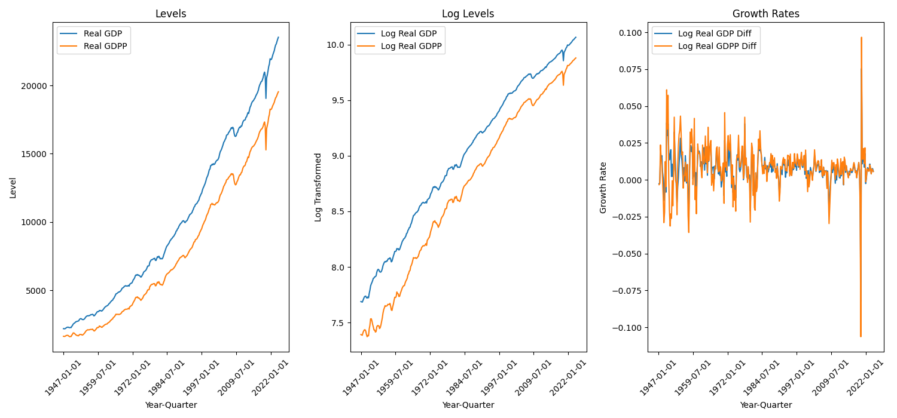
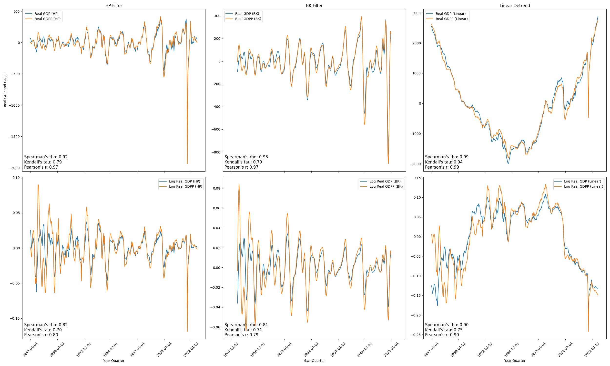

# GDP and GDP-G Volatility

## Introduction

The debate regarding the stabilizing role of government spending in economic fluctuations continues to be actively discussed among macroeconomists. This essay empirically investigates whether government spending (G) contributes to reducing the volatility of Gross Domestic Product (GDP). It does not attempt to attribute the stabilizing effect to any of the usual channels (automatic stabilizers, composition effects, and discretionary fiscal policy) or discuss their mechanisms and timeframes. Nor does it attempt to address whether such spending maximizes the long-run growth rate or the merits of stabilizing GDP. Simply by comparing GDP volatility with that of GDP net of government spending (GDP-G), we assess whether government expenditure provides a stabilizing influence on economic activity, broadly defined. Employing historical time-series data, we explore several volatility measures and evaluate each method's strengths and limitations.

## The Data

Historical quarterly data on GDP and government spending (G) were collected. Both series are in real terms, seasonally adjusted, quarterly, and cover the time span from 1949 to 2024. Real GDP (GDPC1) and government spending (GCEC1) were collected from FRED (Federal Reserve Economic Data). We computed GDP net of government spending to obtain the private GDP (GDPP) series:

$$GDPP = GDP - G$$

The GDP and GDPP series are plotted below.

This paper applies multiple statistical measures to evaluate and compare the volatility of GDP versus GDPP. The methods are general and can be applied to any cross section (e.g., countries, states, etc.) as long as the data are available. The accompanying codebase is designed to be easily adaptable to other datasets.

## Data Transformation

Standard deviation and coefficient of variation are calculated for several formulations of the GDP and GDPP series, including levels, log levels, growth rates, and detrended (cyclical) levels. With the exception of growth rates, the series are detrended using three linear detrending methods: the Hodrick-Prescott (HP) filter, the Baxter-King (BK) filter, and a simple linear detrender.

The transformation of the data for logs and log differences is straightforward. The notation for the the log of a variable $X$ is $\ln X$; the log difference of a variable $X$ is $\Delta \ln X$.

The HP filter is derived from the time domain and is a smoothing technique used to estimate the trend component of a time series. It does so by solving an optimization problem that balances two competing objectives: (1) keeping the trend close to the original data, and (2) ensuring the trend is smooth by penalizing excessive curvature.

The smoothing parameter ($\lambda$) controls how much weight is given to smoothness versus fidelity to the data. A higher values forces the trend to be more rigid and smooth, emphasizing long-term movements. Conversely, a lower value allows the trend to be more flexible, capturing shorter-term fluctuations. For our case, we will use a $\lambda = 1600$, suggested by Hodrick and Prescott [here](https://business.columbia.edu/sites/default/files-efs/pubfiles/205/post-war.pdf) for quarterly data. Page 4 explains $\lambda$ choice and Table 1 validates it against other options. Once the trend component $\tau_t$ is estimated, the cyclical component is calculated as the residual $c_t = y_t - \tau_t$.

The BK filter is derived from the frequency domain and is designed to isolate specific “cyclical” components of a time series by removing both high-frequency (very short-term) fluctuations and low-frequency (long-term trend) fluctuations. You define the range or "band" of frequencies to remove, such as noise or trend frequencies, outside of which the filter will remove the fluctuations. The assumptions that make the BK filter easy to calculate also result in the filter discarding data at the edges of the series.

For our purposes, we will use the BK filter with a low frequency of 6 and high frequency of 32, and a K of 12, discussed [here](https://www.jstor.org/stable/2646708). The result is that the filtered series will have 12 quarters of data removed from the beginning and end of the series.

The simple linear detrender is the most straightforward method. It fits a linear trend to the data and subtracts it from the original data. That is, it fits a line using least squares to the original data, then calculates the corresponding point along the line for each value, and subtracts the two. The result is the "residual" or "detrended" series. No attempt is made to find cycles in the data using this method.

The figure below shows the GDP and GDPP series detrended using the HP filter, BK filter, and simple linear detrender, totaling six plots. The top row shows the levels, and the bottom row shows the log levels. The columns illustrate the different detrending methods. The correlation is plotted at the bottom left corner of each plot. The detrended plots are similar for both the GDP and GDPP series, suggesting that all the detrenders removed similar trends from each series, i.e., the plotted detrended components look very similar. That said, the HP and BK cycles display more realistic cycles than the simple linear detrender. The linear detrender results are easy to explain: GDP and GDPP are accelerating, so the linear detrender is above the series; while log GDP and log GDPP are decaying, so the linear detrender is below the series. Lastly, despite appearances, Augmented Dickey-Fuller tests and ARCH tests ruled out unit roots and heteroskedasticity in the HP- and BK-filtered data.

## Volatility Metrics

Volatility metrics are used to assess the stability of variables. By quantifying the variability of GDP and GDPP, we can analyze the extent to which government expenditures reduce the volatility of GDP. We consider a range of volatility measures to capture different aspects of economic fluctuations.

**Standard Deviation of:**
1. Levels: Measures absolute volatility in GDP and GDPP.
2. Log Levels: Measures absolute volatility in GDP and GDPP, but in log terms.
3. Log Differences (Growth Rates): Measures volatility in GDP and GDPP, but in growth rates.
4. Detrended (Cyclical) Series: Focuses on business-cycle variations by filtering out trends. 

**Coefficient of Variation (CV):** A relative measure of volatility accounting for scale differences.
1. Levels: A relative measure of volatility accounting for scale differences.
2. Growth Rates: A relative measure of volatility accounting for scale differences.
3. Detrended (Cyclical) Series: Provides a relative measure of volatility. However, to avoid distortion caused by a near-zero or rapidly changing mean, the CV is scaled by the mean of the original series.

**Regression of Cyclical Components:** Evaulate the relationship between government spending and GDP volatility.
1. Regress $GDP_{cyclical,t}$ on $GDPP_{cyclical,t}$.

## Empirical Analysis

### Standard Deviation

The standard deviation straightforwardly captures the fluctuations in GDP and GDPP. Standard deviation for any variable $X$ is calculated as:

$$\sigma = \sqrt{\frac{1}{N} \sum_{i=1}^{N} (X_i - \mu)^2}$$

Table 1 below shows the standard deviation of GDP and GDPP using levels, log levels, and detrended (cyclical) levels. The difference is the $\sigma_{GDP} - \sigma_{GDPP}$. The results are clear, with a few exceptions, the difference is negative, meaning GDPP is more volatile than GDP.

#### Table 1: Standard Deviation
|      |   Levels |   Log Transformed |   Log Differences |   HP Filtered |   BK Filtered |   Linear Detrended |   Log HP Filtered |   Log BK Filtered |   Log Linear Detrended |
|:-----|---------:|------------------:|------------------:|--------------:|--------------:|-------------------:|------------------:|------------------:|-----------------------:|
| GDP  | 6212.930 |             0.696 |             0.011 |       167.371 |       147.712 |           1187.932 |             0.016 |             0.015 |                  0.075 |
| GDPP | 5291.847 |             0.771 |             0.016 |       182.650 |       162.991 |           1171.344 |             0.025 |             0.024 |                  0.082 |
| Diff |  921.084 |            -0.075 |            -0.005 |       -15.279 |       -15.280 |             16.588 |            -0.009 |            -0.009 |                 -0.007 |

### Coefficient of Variation (CV)

To provide a scale-neutral comparison, we use the coefficient of variation. When the mean is near zero, as is the case with filters, we scale using the average of the level series.

$$CV = \frac{\sigma}{\mu}$$

Table 2 below shows the coefficient of variation of GDP and GDPP using levels, log levels, and detrended (cyclical) levels. The difference is the $CV_{GDP} - CV_{GDPP}$. The results are clear, with a few exceptions, the difference is negative, meaning GDPP is more volatile than GDP.

#### Table 2: Coefficient of Variation
|      |   Levels |   Log Transformed |   Log Differences |   HP Filtered |   BK Filtered |   Linear Detrended |   Log HP Filtered |   Log BK Filtered |   Log Linear Detrended |
|:-----|---------:|------------------:|------------------:|--------------:|--------------:|-------------------:|------------------:|------------------:|-----------------------:|
| GDP  |    0.612 |             0.077 |             1.458 |         0.016 |         0.015 |              0.117 |             0.002 |             0.002 |                  0.008 |
| GDPP |    0.671 |             0.089 |             1.969 |         0.023 |         0.021 |              0.148 |             0.003 |             0.003 |                  0.009 |
| Diff |   -0.058 |            -0.011 |            -0.511 |        -0.007 |        -0.006 |             -0.031 |            -0.001 |            -0.001 |                 -0.001 |

### Regression of Cyclical Components

A regression analysis of the cyclical components evaluates the relationship between GDP and GDPP. Since the regression is performed on detrended (cyclical) components, the interpretation is based on deviations from the long-run trend rather than absolute levels.

$$GDP_{cyclical,t} = \alpha + \beta \cdot GDPP_{cyclical,t} + \epsilon_t$$

Table 3 below shows the results of the regressions. All of the coefficients for $\beta$ are positive and less than 1, indicating that the cyclical component of GDP does not move as dramatically as movements in GDPP. Hence, GDP appears to be more stable than GDPP.

#### Table 3: Regression of Cyclical Components
| Dependent Variable    | Independent Variable | Coefficient | Std. Error | t-Statistic | p-Value | 95% CI              |
|-----------------------|----------------------|-------------|------------|-------------|---------|---------------------|
| Real GDP HP Cycle        | Real GDPP HP Cycle      | 0.8918      | 0.012      | 74.694      | 0.000   | [0.868, 0.915]      |
| Real GDP BK Cycle        | Real GDPP BK Cycle      | 0.8797      | 0.013      | 68.490      | 0.000   | [0.854, 0.905]      |
| Log Real GDP HP Cycle    | Log Real GDPP HP Cycle  | 0.5234      | 0.022      | 23.625      | 0.000   | [0.480, 0.567]      |
| Log Real GDP BK Cycle    | Log Real GDPP BK Cycle  | 0.4950      | 0.023      | 21.538      | 0.000   | [0.450, 0.540]      |

## Conclusion

By comparing various measures of volatility between GDP and GDP net of government spending, the findings consistently indicate that removing government expenditure results in greater volatility. Standard deviation and coefficient of variation metrics, as well as regression analysis of cyclical components, reveal that the private sector (GDPP) is more volatile than the overall GDP. This does not tell us whether the stabilization comes from curtailing busts, crowding out investment, or both. Further research could explore the specific mechanisms through which government spending achieves this stability and examine its implications for long-run economic growth.
